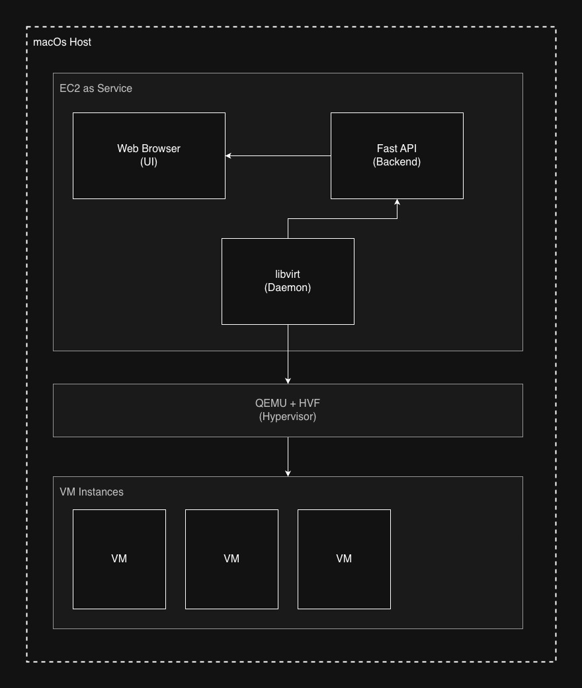

# System Architecture

## Overview

- **Presentation Layer**: React based Web UI
- **API Layer**: FastAPI REST Enpoints
- **Data Access Layer**: SQLite + libvirt API
- **Infrastructure Layer**: libvirt/QEMU

## High Level Diagram

<!--  -->

## High Level Context

### Web Browser

**Purpose**: Enable user interaction with the backend system.

#### Presentation Layer

- Instance Management
- Web Terminal
- SSH Key Management


### Backend

**Purpose**: The backend handles all low-level operations through multiple layers.

#### API Layer

**Purpose**: Expose HTTP/WebSocket endpoints for client communication.

**Endpoints**:
```
API Layer (FastAPI)
|
|----/api/instances                 # Instance management
|   |---- POST      /               # Create new instance
|   |---- GET       /               # List all instances
|   |---- GET       /{id}           # Get instance details
|   |---- POST      /{id}/start     # Start instance
|   |---- POST      /{id}/stop      # Stop instnace
|   |---- POST      /{id}/reboot    # Reboot instance
|   |---- DELETE    /{id}           # Terminate instance
|
|----/api/ssh-key                   # SSH Key management
|   |---- POST      /               # Import SSH Key
|   |---- GET       /               # List all keys
|   |---- GET       /{name}         # Get key details
|   |---- DELETE    /{name}         # Delete key
|
|----/api/images                    # Image catalogue
|   |---- GET       /               # List available images
|   |---- GET       /{id}           # Get image details
|
|----/api/ws/terminal               # WebSocket connection
|   |---- WS        /{id}           # Connect to instance terminal
|
|----/api/monitor                   # System Monitoring
|   |---- GET       /health         # Quick Pulse for health check
|   |---- GET       /stats          # Get stats for host system usage (cpu, memory, disk)
```
**Requirements Satisfied**:
- **Instance Creation**: REQ-INST-001 to REQ-INST-015
- **SSH Key Management**: REQ-SSH-001 to REQ-SSH-007
- **Image Management**: REQ-IMG-001 to REQ-IMG-005
- **Web Terminal**: REQ-TERM-001 to REQ-TERM-012

#### Services Layer

**Purpose**: Implement business logic and interact with the host system.

**Component**:
```
Service Layer
|
|---- LibvirtManager                # VM Lifecycle management
|   |---- create_instance()         # Create and boot VM
|   |---- start_instance()          # Start stopped VM
|   |---- stop_instance()           # Shutdown VM
|   |---- reboot_instance()         # Reboot VM
|   |---- terminate_instance()      # Delete VM and resources
|   |---- get_instance_status()     # Get VM state
|   |---- get_instance_ip()         # Get VM IP address
|
|---- NetworkManager                # Network Config management
|   |---- create_network()          # Create VM Network
|   |---- allocate_mac()            # Generate mac address
|   |---- get_dhcp_leases()         # Query DHCP assignments
|
|---- StorageManager                # Disk management
|   |---- create_storage_pool()     # Initialize storage
|   |---- create_disk()             # Create qcow2 disk
|   |---- delete_disk()             # Remove disk files
|
|---- SSHManager                    # Key Validation and management
|   |---- validate_key()            # Key validation
|   |---- calculate_fingerprint()   # Compute MD5 hash
|
|---- WebSockerHandler              # VM Terminal Proxy
|   |---- connect()                 # Establish SSH connection
|   |---- handle_communication      # Relay data bidirectionaly
|   |---- close()                   # Close connection and cleanup resources
```
**Requirements Satisfied**:
- **Instance Creation**: REQ-INST-001, REQ-INST-006, REQ-INST-009 to REQ-INST-013, REQ-INST-015
- **Network Management**: REQ-NET-001 to REQ-NET-008
- **SSH Key Management**: REQ-SSH-001 to REQ-SSH-003
- **Web Terminal**: REQ-TERM-001 to REQ-TERM-005, REQ-TERM-009 to REQ-TERM-012

#### Data Layer

**Purpose**: Manage persistent information and provide data abstraction.

**Component**:
```
Data Layer
|
|---- SQL ORM                       # DB Abstraction
|   |---- Session management
|   |---- Query building
|   |---- Transation Handling
|
|---- Model                         # Schema for Instance, Image, SSHKey
|   |---- Instance
|   |   |---- id
|   |   |---- name
|   |   |---- instance_type
|   |   |---- status
|   |   |---- memory_mb
|   |   |---- disk_gb
|   |   |---- vcpus
|   |   |---- ip_address
|   |   |---- ssh_key_name
|   |   |---- libvirt_uuid
|   |   |---- created_at
|   |   |---- launched_at
|   |   |---- terminated_at
|   |
|   |---- Image
|   |   |---- id
|   |   |---- name
|   |   |---- description
|   |   |---- os
|   |   |---- arch
|   |   |---- file_path
|   |   |---- created_at
|   |
|   |---- SSHKey
|       |---- name
|       |---- public_key
|       |---- fingerprint
|       |---- created_at
|
|---- Database                      # SQLite at (~/.ec2-as-serice)
|   |---- Location: ~/.ec2-as-service/ec2service.db
```
**Requirements Satisfied**:
- **Instance Creation**: REQ-INST-014
- **SSH Key Management**: REQ-SSH-007
- **Image Management**: REQ-IMG-005
- **Reliability**: REQ-REL-001